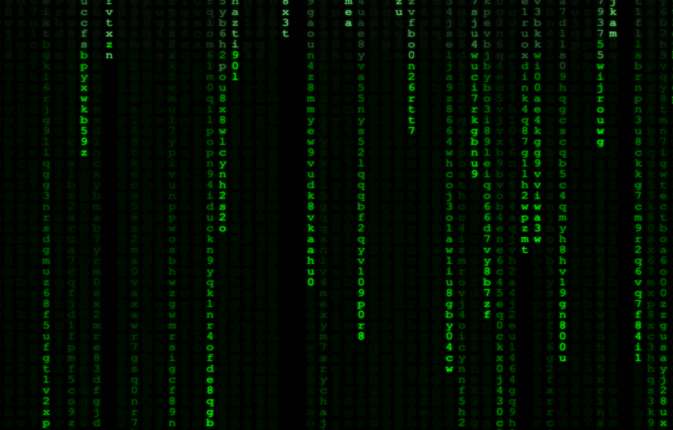
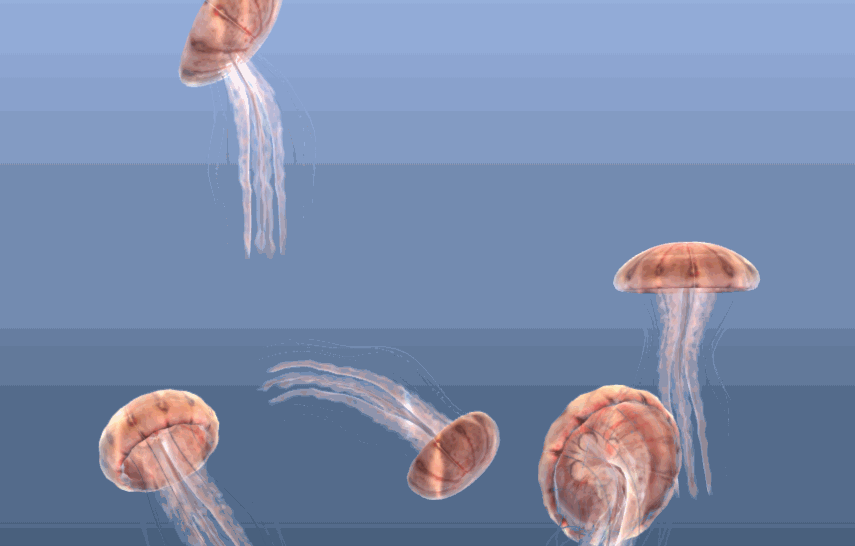

<h1 align="center">
  Web Screensavers
    
  
  
  
</h1>

## Usage
How to install screensaver as web view? First, you need to secure the url. You can fork and host this repository to your own web server OR copy gh-pages url from the sources below.

### Matrix
By [Ebram Marzouk](https://codepen.io/P3R0/pen/MwgoKv). https://lodev09.github.com/web-screensavers/matrix

### Jellyfish
By @arodic. https://lodev09.github.com/web-screensavers/jellyfish

### Flat Surface Shader
By @wagerfield. https://lodev09.github.com/web-screensavers/flat-surface-shader

### macOS
Get/install **WebViewScreenSaver** [from here](https://github.com/liquidx/webviewscreensaver) and enter the url. For macOS Catalina, use [this fork](https://github.com/agologan/webviewscreensaver).

### Windows
Use the url and follow installation [from here](https://github.com/cwc/web-page-screensaver).

## Enjoy!
Jovanni Lo [@lodev09](https://twitter.com/lodev09)